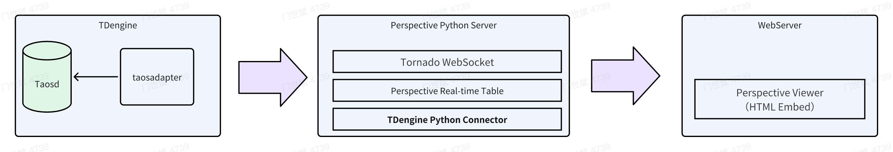
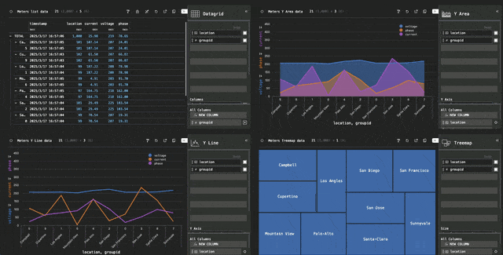

<!-- omit in toc -->
# Integration With Perspective

Perspective is an open-source and powerful data visualization library that enables interactive, real-time data analysis in web applications. Developed by Prospective.co, Perspective leverages WebAssembly and Web Workers to provide high-performance data visualization capabilities directly in the browser. With Perspective, you can create dynamic dashboards, charts, and tables that update in real-time, allowing users to explore and interact with data seamlessly. Perspective's flexibility, speed, and ease of use make it an excellent choice for building data-driven applications that require real-time data visualization and analysis.

Through TDengine's Python connector` Perspective can support TDengine data sources and provide real-time functions such as various data charts and analysis.

<!-- omit in toc -->
## Table of Contents

- [Introduction](#introduction)
- [Prerequisites](#prerequisites)
- [Display Visualized Data](#display-visualized-data)
- [Develop Perspective Server](#develop-perspective-server)
  - [Insert Data into TDengine](#insert-data-into-tdengine)
  - [Read TDengine Time-Series Data in Real-Time](#read-tdengine-time-series-data-in-real-time)
  - [Embed \& Configure Perspective Viewer](#embed--configure-perspective-viewer)


## Introduction

Perspective Server uses `TDengine Python Connector` to obtain real-time time-series data from the TDengine database, and provides the data to `Perspective Viewer` through Websocket to display various charts.



## Prerequisites

- TDengine 3.3.5.8 and above version is installed and running normally (both Enterprise and Community versions are available).
- taosAdapter is running normally, refer to [taosAdapter Reference](../../../tdengine-reference/components/taosadapter/).
- Install python 3.10+ version, refer to [install python](https://docs.python.org/).
- Run the 'install.sh' script to download and install the TDengine client library and related dependencies locally.

## Display Visualized Data

   1. **start the perspective service:**

       Run the 'run.sh' script, start the perspective service, pull data from TDengine every 300 milliseconds, and stream the data to the web-based perspective viewer.
       
       ```shell
       sh run.sh
       ```

   2. **Start a static web service:**

      Start a static web service and access prsp-viewer.html resources to display visual data in the browser.
      
      ```pycon
      python -m http.server 8081
      ```

      Display effect

      [](imgs/prsp-tdengine.gif)

## Develop Perspective Server

### Insert Data into TDengine

   The producer.py script to periodically insert data into TDengine. This script simulates real-time data ingestion by generating random data points and inserting them into the TDengine database.
   
   1. **Connecting to TDengine:**

      ```python
      import taosws
      
      TAOS_HOST = "localhost"
      
      # =============================================================================
      # TDengine connection parameters
      # =============================================================================
      TAOS_HOST = "localhost"          # TDengine server host
      TAOS_PORT = 6041                 # TDengine server port
      TAOS_USER = "root"               # TDengine username
      TAOS_PASSWORD = "taosdata"       # TDengine password
      
      TAOS_DATABASE = "power"          # TDengine database name
      TAOS_TABLENAME = "meters"        # TDengine table name
      
      
      TAOS_PORT = 6041
      TAOS_USER = "root"
      TAOS_PASSWORD = "taosdata"
      
      conn = taosws.connect(host=TAOS_HOST, port=TAOS_PORT, user=TAOS_USER, password=TAOS_PASSWORD)
      ```

   2. **Creating a table:**

      ```python
      sql = f"""
          CREATE TABLE IF NOT EXISTS meters (
              `ts` TIMESTAMP, 
              `current` FLOAT, 
              `voltage` INT, 
              `phase` FLOAT
              ) TAGS (
                  `groupid` INT, 
                  `location` BINARY(16)
              )
          """
   
      conn.execute(sql)
      ```

   3. **Inserting data:**

      The `gen_data()` method generates a series of random stock trades on every call:
   
      ```python
      import random
      from datetime import datetime, date, timezone as tz
   
      def gen_data():
          modifier = random.random() * random.randint(1, 50)
          return [{
              "ts": datetime.now(),
              "current": random.uniform(0, 75) + random.randint(0, 9) * modifier,
              "voltage": random.randint(200, 225),
              "phase": random.uniform(0, 105) + random.randint(1, 3) * modifier,
          } for _ in range(NUM_ROWS_PER_INTERVAL)]
      ```
   
      The `insert_data()` method uses prepared statements and batch inserts to enhance performance. By generating a batch of records at a time and using a prepared SQL statement, the method minimizes the overhead associated with multiple individual insert operations. This approach ensures efficient data insertion into the TDengine database.
   
      ```python
      def insert_data(
              conn, 
              progress_counter,
              table_name: str = TAOS_TABLENAME
              ) -> None:
          """
          Insert data into the TDengine table
          """
          records = gen_data()
       
          # prepare a parameterized SQL statement
          sql = f"INSERT INTO ? USING `{table_name}` (groupid, location) TAGS(?,?) VALUES (?,?,?,?)"
          stmt = conn.statement()
          stmt.prepare(sql)
          tableNo = progress_counter % 10
          tbname = f"d_bind_{tableNo}"
          tags = [
              taosws.int_to_tag(tableNo),
              taosws.varchar_to_tag(SECURITIES[tableNo]),
          ]
   
          stmt.set_tbname_tags(tbname, tags)
       
          # prepare the columns into their respective lists
          timestamps = [int(record['ts'].timestamp() * 1000) for record in records]
          currents = [record['current'] for record in records]
          voltages = [record['voltage'] for record in records]
          phases = [record['phase'] for record in records]
   
          # bind the parameters and execute the statement
          stmt.bind_param([
              taosws.millis_timestamps_to_column(timestamps),
              taosws.floats_to_column(currents),
              taosws.ints_to_column(voltages),
              taosws.floats_to_column(phases),
              ]
          )
          # send the batch for insert
          stmt.add_batch()
          stmt.execute()
          logger.debug(f"TDengine - Wrote {len(records)} rows to table {table_name}")
      ```

### Read TDengine Time-Series Data in Real-Time

The `perspective_server.py` script starts a Perspective server that reads data from TDengine and streams it to a Perspective Table via a Tornado WebSocket.

   1. **Connecting to TDengine:**

      ```python
      import taosws
      
      TAOS_HOST = "localhost"
      TAOS_PORT = 6041
      TAOS_USER = "root"
      TAOS_PASSWORD = "taosdata"
      
      conn = taosws.connect(host=TAOS_HOST, port=TAOS_PORT, user=TAOS_USER, password=TAOS_PASSWORD)
      ```

   2. **Reading data from TDengine:**

      The `read_tdengine()` function queries the TDengine database and retrieves the latest stock data:
   
      ```python
      def read_tdengine(conn):
              conn: taosws.Connection, 
              ) -> list[dict]:
          try:
              # query the database
              sql = f"""
                  SELECT `ts`, location, groupid, current, voltage, phase
                  FROM {TAOS_TABLENAME}
                  WHERE `ts` >= NOW() - 12h
                  ORDER BY `ts` DESC
                  LIMIT 1000
                  """
              logger.debug(f"Executing query: {sql}")
              res = conn.query(sql)
              data = [
                  {
                      "timestamp": convert_ts(row[0]),
                      "location": row[1],
                      "groupid": row[2],
                      "current": row[3],
                      "voltage": row[4],
                      "phase": row[5],
                  }
                  for row in res
              ]
              logger.info(f"select result: {data}")
              return data
          except Exception as err:
              logger.error(f"Failed to query tdengine: {err}")
              raise err
   
      ```

   3. **Updating Perspective Table:**

      The `perspective_thread()` function creates a Perspective table and updates it with new data from TDengine every 300 milliseconds:
   
      ```python
      def perspective_thread(perspective_server, tdengine_conn):
          """
          Create a new Perspective table and update it with new data every 50ms
          """
          # create a new Perspective table
          client = perspective_server.new_local_client()
          schema = {
              "timestamp": datetime,
              "location": str,
              "groupid": int,
              "current": float,
              "voltage": int,
              "phase": float,
          }
          # define the table schema
          table = client.table(
              schema,
              limit=1000,                     # maximum number of rows in the table
              name=PERSPECTIVE_TABLE_NAME,    # table name. Use this with perspective-viewer on the client side
          )
          logger.info("Created new Perspective table")
   
          # update with new data every 50ms
          def updater():
              data = read_tdengine(tdengine_conn)
              table.update(data)
              logger.debug(f"Updated Perspective table: {len(data)} rows")
   
          logger.info(f"Starting tornado ioloop update loop every {PERSPECTIVE_REFRESH_RATE} milliseconds")
          # start the periodic callback to update the table data
          callback = tornado.ioloop.PeriodicCallback(callback=updater, callback_time=PERSPECTIVE_REFRESH_RATE)
          callback.start()
      ```

   4. **Starting Tornado WebSocket Server:**

      The `make_app()` function sets up a Tornado application with a WebSocket handler to serve the Perspective table:
   
      ```python
      def make_app(perspective_server):
          return tornado.web.Application([
              (
                  r"/websocket",
                  perspective.handlers.tornado.PerspectiveTornadoHandler,
                  {"perspective_server": perspective_server},
              ),
          ])
      ```

   5. **Running the server:**

      The `perspective-viewer` element is configured with the "Pro Dark" theme to match the dark background and provide a consistent visual appearance.
   
      ```python
      if __name__ == "__main__":
          perspective_server = perspective.Server()
          tdengine_conn = create_tdengine_connection()
          app = make_app(perspective_server)
          app.listen(8080, address='0.0.0.0')
       
          loop = tornado.ioloop.IOLoop.current()
          loop.call_later(0, perspective_thread, perspective_server, tdengine_conn)
          loop.start()
      ```

### Embed & Configure Perspective Viewer

The `prsp-viewer.html` file embeds a Perspective Table in an HTML page. It connects to the Perspective server via a WebSocket and displays the real-time data streamed from TDengine.

1. **HTML Component:**

   The HTML file includes the necessary Perspective libraries and sets up a `<perspective-viewer>` element within a container. This custom HTML component, written in WebAssembly, provides easily embeddable and highly interactive real-time data visualization on top of TDengine data. The viewer is configured to connect to the Perspective server via WebSocket and load the `meters_values` table, allowing for dynamic data visualization.

2. **Styling:**

   CSS styles are applied to ensure the viewer occupies the full viewport and has a dark background.

3. **JavaScript Initialization:**

   A script is included to load the Perspective viewer and connect it to the Perspective server via WebSocket. The viewer is bound to the `meters_values` table on the server, allowing real-time data updates to be displayed.

   ```html
   <script type="module">
       import perspective from "https://cdn.jsdelivr.net/npm/@finos/perspective@3.1.3/dist/cdn/perspective.js";
   
       document.addEventListener("DOMContentLoaded", function() {
           async function load_viewer() {
               const table_name = "meters_values";
               const viewer = document.getElementById("prsp-viewer");
               const websocket = await perspective.websocket("ws://localhost:8080/websocket");
               const server_table = await websocket.open_table(table_name);
               await viewer.load(server_table);
           }
           load_viewer();
       });
   </script>
   ```

